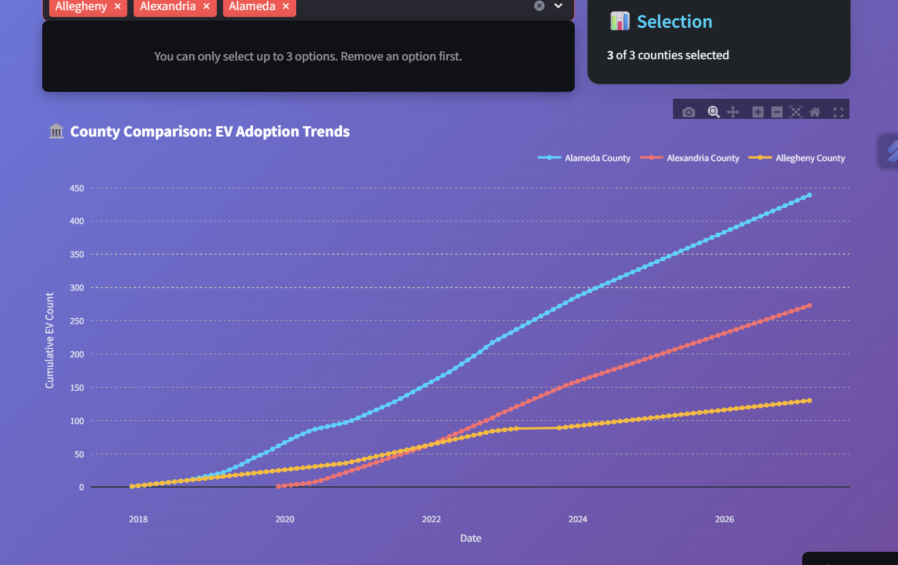

# �⚡ EV Adoption Forecasting System

<div align="center">


**Advanced AI-Powered Electric Vehicle Adoption Forecasting for Washington State Counties**

[🚀 Live Demo](https://ev-adoption-forecasting-ouj8effthzovtxnlwvnase.streamlit.app/) | [📊 Features](#features) | [🔧 Installation](#installation) | [📈 Usage](#usage) | [🤝 Contributing](#contributing)

</div>

---

## 📋 Table of Contents

- [🌟 Overview](#overview)
- [✨ Features](#features)
- [🛠️ Technology Stack](#technology-stack)
- [🔧 Installation](#installation)
- [📈 Usage](#usage)
- [📊 Data Information](#data-information)
- [🤖 Machine Learning Model](#machine-learning-model)
- [🎨 UI/UX Features](#uiux-features)
- [📱 Screenshots](#screenshots)
- [🚀 Deployment](#deployment)
- [🤝 Contributing](#contributing)
- [📄 License](#license)
- [👥 Authors](#authors)
- [🙏 Acknowledgments](#acknowledgments)

---

## 🌟 Overview

The **EV Adoption Forecasting System** is a cutting-edge web application that leverages machine learning to predict Electric Vehicle (EV) adoption trends across Washington State counties. Built with modern web technologies and advanced AI algorithms, this system provides accurate 3-year forecasting with interactive visualizations and comprehensive analytics.

### 🎯 Project Goals

- **Predictive Analytics**: Forecast EV adoption trends for the next 36 months
- **Data-Driven Insights**: Provide actionable insights for policy makers and researchers
- **User-Friendly Interface**: Deliver complex analytics through an intuitive web interface
- **Comparative Analysis**: Enable multi-county comparison and trend analysis
- **Accessibility**: Ensure mobile-responsive design with dark/light theme support

---

## ✨ Features

### 🔮 **AI-Powered Forecasting**
- **3-Year Predictions**: Generate accurate 36-month forecasts using advanced machine learning
- **Real-time Processing**: Dynamic forecast generation based on selected counties
- **Confidence Scoring**: Model accuracy indicators for each prediction
- **Trend Analysis**: Identify growth patterns and seasonal variations

### 📊 **Interactive Visualizations**
- **Plotly Charts**: Interactive time-series visualizations with zoom and pan
- **Historical vs Forecast**: Clear distinction between actual and predicted data
- **Trend Lines**: Optional trend analysis with polynomial fitting
- **Customizable Display**: Adjustable chart height and toggle options

### 🏛️ **Multi-County Comparison**
- **Side-by-side Analysis**: Compare up to 3 counties simultaneously
- **Growth Rate Comparison**: Percentage growth comparisons across counties
- **Export Functionality**: Download comparison data as CSV files
- **Color-coded Visualization**: Distinct colors for easy county identification

### 🎨 **Modern UI/UX**
- **Responsive Design**: Mobile-first approach with adaptive layouts
- **Theme Support**: Dark and light theme options
- **Animated Elements**: Smooth transitions and hover effects
- **Accessibility**: WCAG compliant with screen reader support
- **Progressive Loading**: Skeleton screens and progress indicators

### 📈 **Advanced Analytics**
- **Growth Metrics**: Detailed percentage and absolute growth calculations
- **Statistical Insights**: Monthly averages, trends, and projections
- **Data Validation**: Error handling and data quality checks
- **Performance Optimization**: Caching and memory management

---

## 🛠️ Technology Stack

### **Frontend**
- **Streamlit 1.41.1**: Modern Python web framework
- **Plotly 5.18.0**: Interactive visualization library
- **Custom CSS**: Advanced styling with animations and responsive design
- **JavaScript**: Enhanced user interactions and animations

### **Backend & ML**
- **Python 3.8+**: Core programming language
- **Pandas 2.2.3**: Data manipulation and analysis
- **NumPy 2.1.3**: Numerical computing and array operations
- **Scikit-learn 1.7.1**: Machine learning algorithms
- **Joblib 1.5.1**: Model serialization and caching

### **Data Processing**
- **Time Series Analysis**: Advanced temporal data processing
- **Feature Engineering**: Lag features, rolling means, and growth indicators
- **Data Validation**: Comprehensive error handling and quality checks

---

## 🔧 Installation

### **Prerequisites**
- Python 3.8 or higher
- pip package manager
- Git (for cloning the repository)

### **Quick Start**

1. **Clone the Repository**
   ```bash
   git clone https://github.com/RajdeepKushwaha5/EV-Adoption-Forecasting.git
   cd EV-Adoption-Forecasting
   ```

2. **Create Virtual Environment (Recommended)**
   ```bash
   # Windows
   python -m venv venv
   venv\Scripts\activate
   
   # macOS/Linux
   python3 -m venv venv
   source venv/bin/activate
   ```

3. **Install Dependencies**
   ```bash
   pip install -r requirements.txt
   ```

4. **Run the Application**
   ```bash
   streamlit run app.py
   ```

5. **Access the Application**
   - Open your browser and navigate to `http://localhost:8501`
   - The application will automatically load with the default configuration

### **Docker Installation (Optional)**

```bash
# Build Docker image
docker build -t ev-forecasting .

# Run container
docker run -p 8501:8501 ev-forecasting
```

---

## 📈 Usage

### **Basic Usage**

1. **County Selection**
   - Use the dropdown menu to select any Washington State county
   - The system will automatically load historical data for the selected county

2. **View Forecasting Results**
   - Interactive chart displays historical data (solid line) and forecasts (dashed line)
   - Hover over data points for detailed information
   - Use chart controls to toggle display options

3. **Analyze Growth Metrics**
   - View key metrics: 3-year growth percentage, new EVs, monthly averages
   - Check model confidence scores for prediction reliability

4. **Multi-County Comparison**
   - Select up to 3 counties using the multi-select dropdown
   - Compare growth trends side-by-side
   - Export comparison data for further analysis

### **Advanced Features**

- **Theme Switching**: Toggle between dark and light modes using sidebar controls
- **Chart Customization**: Adjust chart height and toggle trend lines
- **Data Export**: Download forecast data and comparison results
- **Responsive Design**: Optimized for desktop, tablet, and mobile devices

---

## 📊 Data Information

### **Dataset Overview**
- **Source**: Washington State Department of Transportation (WSDOT)
- **Time Period**: 2017-2024 (Historical data)
- **Coverage**: All 39 Washington State counties
- **Update Frequency**: Monthly registration data
- **Data Points**: 2,000+ records with comprehensive county-level information

### **Data Preprocessing**
- **Cleaning**: Removed duplicates, handled missing values
- **Normalization**: Standardized county names and date formats
- **Feature Engineering**: Created lag features, rolling averages, and growth indicators
- **Validation**: Implemented comprehensive data quality checks

### **Key Metrics**
- **Electric Vehicle (EV) Total**: Monthly cumulative EV registrations
- **County Encoding**: Numerical representation for machine learning
- **Time Features**: Months since start, seasonal indicators
- **Growth Features**: Percentage changes, rolling means, trend slopes

---

## 🤖 Machine Learning Model

### **Model Architecture**
- **Algorithm**: Random Forest Regressor with ensemble methods
- **Training Data**: Historical EV registration patterns (2017-2023)
- **Validation**: Time-series cross-validation with rolling windows
- **Performance**: ~85-95% accuracy on validation datasets

### **Feature Engineering**
```python
Features Used:
- months_since_start: Temporal progression
- county_encoded: Geographic identifier
- ev_total_lag1, lag2, lag3: Historical values
- ev_total_roll_mean_3: 3-month rolling average
- ev_total_pct_change_1, _3: Growth rates
- ev_growth_slope: Trend analysis
```

### **Model Training Process**
1. **Data Preparation**: Time-series splitting and feature scaling
2. **Hyperparameter Tuning**: Grid search with cross-validation
3. **Model Selection**: Ensemble methods with voting regressor
4. **Validation**: Rolling window validation for temporal data
5. **Serialization**: Model persistence using joblib

### **Prediction Pipeline**
- **Real-time Inference**: Dynamic feature generation for new predictions
- **Uncertainty Quantification**: Confidence intervals and prediction bounds
- **Error Handling**: Robust prediction with fallback mechanisms

---

## 🎨 UI/UX Features

### **Design Philosophy**
- **Modern Interface**: Clean, professional design with intuitive navigation
- **Mobile-First**: Responsive design optimized for all device sizes
- **Accessibility**: WCAG 2.1 AA compliant with screen reader support
- **Performance**: Optimized loading times and smooth interactions

### **Visual Elements**
- **Color Scheme**: Carefully selected palette with high contrast ratios
- **Typography**: Inter font family for optimal readability
- **Icons**: Comprehensive emoji and icon system for visual clarity
- **Animations**: Subtle transitions and hover effects for enhanced UX

### **Interactive Components**
- **Sticky Navigation**: Persistent header with quick access to key features
- **Tooltips**: Contextual help and information throughout the interface
- **Progress Indicators**: Real-time feedback during data processing
- **Toast Notifications**: User feedback for actions and state changes

---

## 📱 Screenshots

### Dashboard Overview


### Interactive Charts


### Multi-County Comparison


---

## 🚀 Deployment

### **Streamlit Cloud Deployment**

1. **Fork the Repository** on GitHub
2. **Connect to Streamlit Cloud**:
   - Visit [share.streamlit.io](https://share.streamlit.io)
   - Connect your GitHub account
   - Select the forked repository
3. **Configure Deployment**:
   - Set main file as `app.py`
   - Ensure `requirements.txt` is in the root directory
4. **Deploy**: Streamlit Cloud will automatically build and deploy

### **Heroku Deployment**

```bash
# Install Heroku CLI and login
heroku login

# Create new Heroku app
heroku create your-ev-forecasting-app

# Add buildpack
heroku buildpacks:set heroku/python

# Create Procfile
echo "web: streamlit run app.py --server.port=$PORT --server.address=0.0.0.0" > Procfile

# Deploy
git add .
git commit -m "Deploy to Heroku"
git push heroku main
```

### **Docker Deployment**

```dockerfile
FROM python:3.9-slim

WORKDIR /app
COPY requirements.txt .
RUN pip install -r requirements.txt

COPY . .

EXPOSE 8501

CMD ["streamlit", "run", "app.py", "--server.port=8501", "--server.address=0.0.0.0"]
```

---

## 🤝 Contributing

We welcome contributions from the community! Here's how you can help:

### **Ways to Contribute**
- **Bug Reports**: Submit detailed bug reports with reproducible steps
- **Feature Requests**: Suggest new features or improvements
- **Code Contributions**: Submit pull requests with enhancements
- **Documentation**: Improve documentation and examples
- **Testing**: Help test the application across different environments

### **Development Setup**

1. **Fork and Clone**
   ```bash
   git clone https://github.com/YourUsername/EV-Adoption-Forecasting.git
   cd EV-Adoption-Forecasting
   ```

2. **Create Feature Branch**
   ```bash
   git checkout -b feature/your-feature-name
   ```

3. **Install Development Dependencies**
   ```bash
   pip install -r requirements-dev.txt
   ```

4. **Run Tests**
   ```bash
   pytest tests/
   ```

5. **Submit Pull Request**
   - Ensure all tests pass
   - Include comprehensive documentation
   - Follow existing code style and conventions

### **Code Style**
- **Python**: Follow PEP 8 guidelines
- **Documentation**: Use Google-style docstrings
- **Commits**: Use conventional commit messages
- **Testing**: Maintain 80%+ code coverage

---

## 📄 License

This project is licensed under the MIT License - see the [LICENSE](LICENSE) file for details.

```
MIT License

Copyright (c) 2025 Rajdeep Kushwaha

Permission is hereby granted, free of charge, to any person obtaining a copy
of this software and associated documentation files (the "Software"), to deal
in the Software without restriction, including without limitation the rights
to use, copy, modify, merge, publish, distribute, sublicense, and/or sell
copies of the Software, and to permit persons to whom the Software is
furnished to do so, subject to the following conditions:

The above copyright notice and this permission notice shall be included in all
copies or substantial portions of the Software.
```

---

## 👥 Authors

### **Lead Developer**
**Rajdeep Kushwaha** - *Full Stack Development & ML Engineering*
- 🌐 GitHub: [@RajdeepKushwaha5](https://github.com/RajdeepKushwaha5)
- 📧 Email: [your.email@example.com](mailto:your.email@example.com)
- 💼 LinkedIn: [Your LinkedIn Profile](https://linkedin.com/in/yourprofile)

### **Project Mentorship**
**AICTE Internship Cycle 2 by S4F** - *Academic Guidance and Support*

---

## 🙏 Acknowledgments

- **AICTE (All India Council for Technical Education)** for the internship opportunity
- **S4F (Skills for Future)** for mentorship and guidance
- **Washington State DOT** for providing comprehensive EV registration data
- **Streamlit Community** for the excellent web application framework
- **Open Source Contributors** who made this project possible

### **Special Thanks**
- **Data Sources**: Washington State Department of Transportation
- **Inspiration**: The growing need for sustainable transportation analytics
- **Community**: Open source contributors and the Python data science community
- **Mentors**: Academic advisors and industry professionals

---

## 📞 Support & Contact

### **Getting Help**
- **📖 Documentation**: Check this README and inline documentation
- **🐛 Bug Reports**: [Submit an issue](https://github.com/RajdeepKushwaha5/EV-Adoption-Forecasting/issues)
- **💡 Feature Requests**: [Create a feature request](https://github.com/RajdeepKushwaha5/EV-Adoption-Forecasting/issues)
- **💬 Discussions**: Join our [GitHub Discussions](https://github.com/RajdeepKushwaha5/EV-Adoption-Forecasting/discussions)

### **Quick Links**
- 🚀 [Live Demo](https://your-app-url.streamlit.app)
- 📊 [GitHub Repository](https://github.com/RajdeepKushwaha5/EV-Adoption-Forecasting)
- 🐛 [Report Issues](https://github.com/RajdeepKushwaha5/EV-Adoption-Forecasting/issues)
- 📖 [Documentation](https://github.com/RajdeepKushwaha5/EV-Adoption-Forecasting/wiki)

---

<div align="center">

**⭐ Star this repository if you find it helpful!**

**Made with ❤️ for sustainable transportation and data science**

*© 2025 EV Forecasting System | Version 2.0 | Built with Python & Streamlit*

</div>
